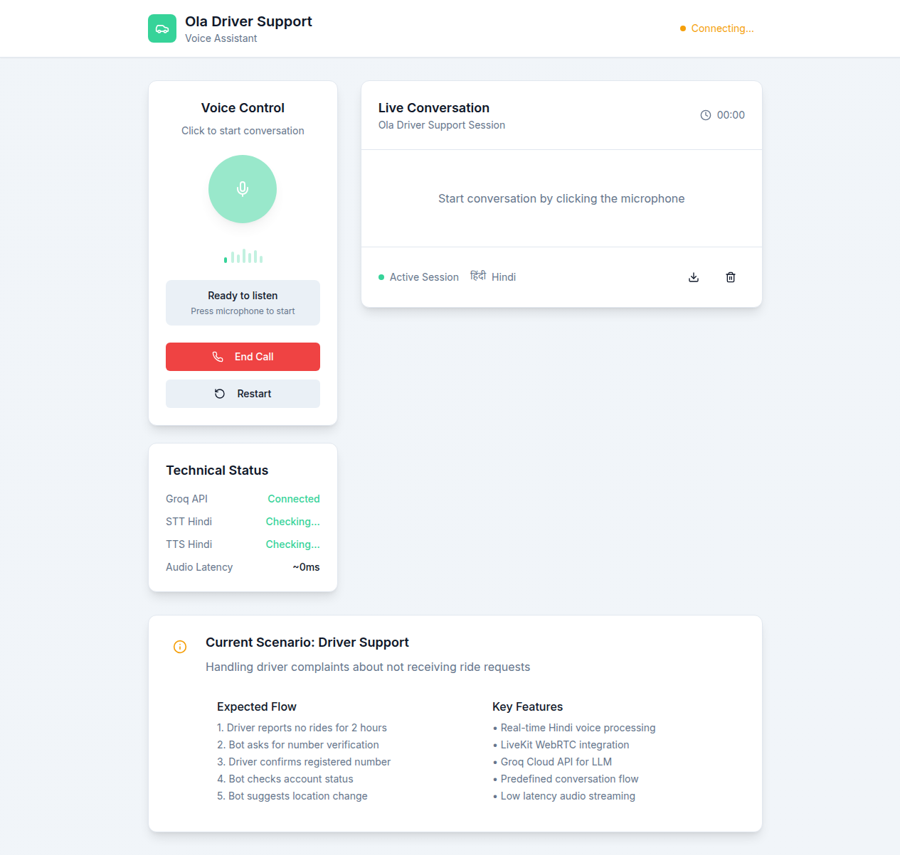

# Ola-driver-support

An Express + Vite React app for an Ola driver voice support bot.

## Live Demo
- Temporary preview: [`https://462e267e-2fbc-4d72-b854-676316ea1c21-00-1nt6iky9hlnjy.kirk.replit.dev/`](https://462e267e-2fbc-4d72-b854-676316ea1c21-00-1nt6iky9hlnjy.kirk.replit.dev/) (may expire)

## Screenshots (Frontend)
<div align="center">



</div>

## Requirements
- Node.js 18+
- npm 9+

## Install
```bash
npm install
```

## Development
PowerShell (Windows):
```powershell
$env:NODE_ENV = 'development'
npx tsx server/index.ts
```
Dev server runs on http://localhost:5000 with Vite mounted automatically.

## Build
```bash
npm run build
```
Outputs:
- Client: `dist/public`
- Server bundle: `dist/index.js`

## Start (production)
```powershell
$env:NODE_ENV = 'production'
node dist/index.js
```
Optional:
```powershell
$env:PORT = '5000'
```

## Environment Variables
- LIVEKIT_API_KEY, LIVEKIT_API_SECRET, LIVEKIT_URL
- GROQ_API_KEY

Example (PowerShell):
```powershell
$env:LIVEKIT_API_KEY = 'your_key'
$env:LIVEKIT_API_SECRET = 'your_secret'
$env:LIVEKIT_URL = 'wss://your-livekit-host'
$env:GROQ_API_KEY = 'your_groq_key'
```

## Scripts
- `npm run build`: build client and server
- `npm start` (Unix shells): runs `node dist/index.js` after build
- `npm run dev` (Unix shells): runs dev server (use PowerShell commands above on Windows)

## License
MIT